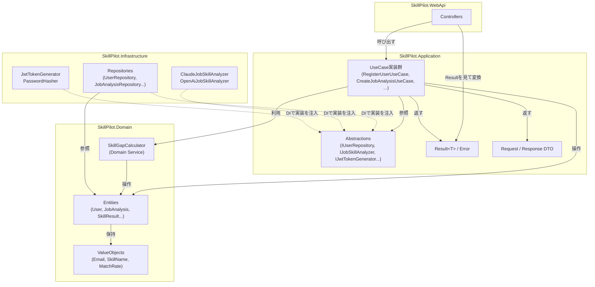

# Architecture

## システム構成

Frontend

- React
- TypeScript

Backend

- [ASP.NET](http://ASP.NET) Core Web API (.NET 10)
- Entity Framework Core

Database

- PostgreSQL

Infrastructure

- Docker

AI

- Claude API(将来的にOpenAI APIへ/との切り替えに対応しやすい構成を目指す)

---

## プロジェクト全体のディレクトリ構成

```
skill-pilot/
├── backend/
├── frontend/
├── docs/
├── scripts/
└── .github/
```

バックエンド内部の詳細な構成は「バックエンドのレイヤー構成」セクションを参照。

---

## 採用理由

### React

- コンポーネント単位でUIを分割でき、ダッシュボード・AI分析・学習ロードマップなど画面数の多い
  本サービスと相性が良い
- TypeScriptとの組み合わせで、APIレスポンス(求人・スキル・ロードマップ)の型を静的に検証できる
- 学習目的・ポートフォリオとしての採用実績・情報量が豊富で、学習コストと採用理由のバランスが良い

### ASP.NET Core

- C#の静的型付け・EF Coreとの親和性により、DBスキーマとバックエンドの型を一貫させやすい
- Clean Architecture / DIコンテナ標準搭載など、SOLID原則に基づいた設計をフレームワークレベルで
  実践しやすい
- 「実際の現場に近い」構成を学ぶという開発目的に対し、エンタープライズ領域で広く使われる
  フレームワークの経験を積める

### PostgreSQL

- JSON型・ウィンドウ関数など将来の分析機能拡張(学習管理の可視化等)に耐える表現力を持つ
- OSSで無償利用でき、Docker上での開発環境構築が容易
- EF Coreとの組み合わせで型安全なクエリを書ける

### Docker

- Backend/Frontend/DBの実行環境をチーム・開発者間で統一できる
- 将来的なSaaS化を見据えたデプロイ(コンテナベースのホスティング)への移行コストを下げる

---

## バックエンドのレイヤー構成

### 設計方針

- Clean Architectureに近い4層構成(**Domain / Application / Infrastructure / WebApi**)を採用する
- 依存の方向は常に外側→内側(`WebApi → Infrastructure → Application → Domain`)。Domainは
  他のどの層にも依存しない
- SOLID原則、特に**依存性逆転の原則(DIP)**を軸に据える。Application層は抽象(インターフェース)
  にのみ依存し、具象実装(EF Core、外部AI API、JWT等)はInfrastructure層に閉じ込める
- **Repositoryパターン**により永続化の詳細をApplication層から隠蔽する
- Claude API / OpenAI APIは共通インターフェースの背後に隠し、設定で切り替え可能にする
  (Strategyパターン + DI)

### ディレクトリ構成

```
backend/
├── SkillPilot.sln
├── src/
│   ├── SkillPilot.Domain/
│   │   ├── Entities/            # User, UserSkill, JobAnalysis, SkillResult, LearningRoadmap
│   │   ├── Enums/                # SkillLevel, SkillCategory, AnalysisStatus
│   │   ├── Common/               # エンティティ基底クラスなど
│   │   └── SkillPilot.Domain.csproj
│   │
│   ├── SkillPilot.Application/
│   │   ├── Abstractions/
│   │   │   ├── Persistence/      # IUserRepository, IJobAnalysisRepository, IUnitOfWork...
│   │   │   ├── Ai/               # IJobSkillAnalyzer
│   │   │   └── Auth/             # IJwtTokenGenerator, IPasswordHasher
│   │   ├── Auth/                 # RegisterUserService, LoginService...
│   │   ├── Profile/               # スキル登録・編集などのユースケース
│   │   ├── Analyses/             # 求人分析のユースケース
│   │   ├── Common/                # DTO, 例外, バリデーション共通処理
│   │   └── SkillPilot.Application.csproj
│   │
│   ├── SkillPilot.Infrastructure/
│   │   ├── Persistence/
│   │   │   ├── SkillPilotDbContext.cs
│   │   │   ├── Configurations/    # IEntityTypeConfiguration<T> (Fluent API)
│   │   │   ├── Repositories/      # Abstractionsの実装
│   │   │   └── Migrations/
│   │   ├── Ai/
│   │   │   ├── Claude/            # ClaudeJobSkillAnalyzer
│   │   │   └── OpenAi/            # OpenAiJobSkillAnalyzer
│   │   ├── Auth/                  # JwtTokenGenerator, PasswordHasher
│   │   ├── DependencyInjection.cs # このプロジェクトのDI登録をまとめる拡張メソッド
│   │   └── SkillPilot.Infrastructure.csproj
│   │
│   └── SkillPilot.WebApi/
│       ├── Controllers/           # AuthController, UsersController, AnalysesController
│       ├── Middleware/            # ExceptionHandlingMiddleware など
│       ├── Program.cs             # コンポジションルート(DIコンテナ登録)
│       ├── appsettings.json
│       └── SkillPilot.WebApi.csproj
│
└── tests/
    ├── SkillPilot.Domain.Tests/
    ├── SkillPilot.Application.Tests/
    ├── SkillPilot.Infrastructure.Tests/
    └── SkillPilot.WebApi.Tests/
```

### 各プロジェクトの責務

#### SkillPilot.Domain

- エンティティ(`User`, `UserSkill`, `JobAnalysis`, `SkillResult`, `LearningRoadmap`)と列挙型を定義する
- 他のどの層にも、外部ライブラリ(EF Core含む)にも依存しない純粋なPOCO。データアノテーションや
  EF Core属性を持たない
- 責務: ドメインの状態と最小限の不変条件(invariant)を表現すること

#### SkillPilot.Application

- ユースケース(例: `RegisterUserService`, `CreateJobAnalysisService`, `UpdateRoadmapItemService`)
- Repository・Unit of Work・AI分析・JWT発行・パスワードハッシュの**インターフェース**
  (`Abstractions/`配下)
- リクエスト/レスポンス用DTO
- Domainのみを参照する。EF CoreやASP.NET Core、外部AI SDKへの参照は持たない
- 責務: 「何をするか」を定義し、「どうやるか」はInfrastructureに委譲すること

#### SkillPilot.Infrastructure

- `SkillPilotDbContext`とEF Core用エンティティ設定(Fluent API)
- Repository実装(`Application.Abstractions`のインターフェースを実装)、Unit of Work実装
- Claude API / OpenAI APIそれぞれのクライアント実装(共通インターフェースを実装)
- JWT発行・パスワードハッシュの実装
- ApplicationとDomainを参照する
- 責務: 外部システム(DB、AI API)とのやり取りの詳細を実装すること。「どうやるか」を担当する

#### SkillPilot.WebApi

- Controller(HTTPリクエスト/レスポンスの変換のみを行い、ビジネスロジックは持たない)
- Middleware(例外ハンドリング、JWT認証設定)
- `Program.cs`(DIコンテナへの登録 = コンポジションルート)
- ApplicationとInfrastructureを参照する。ただしInfrastructureへの参照はDI登録のためだけに使い、
  Controllerから直接Infrastructureの型を使わない
- 責務: HTTPの入り口。認証ミドルウェア・ルーティング・DI構成を担当する

### プロジェクト参照関係(Project Reference)

```
SkillPilot.Domain          ← 何も参照しない
SkillPilot.Application     → Domain
SkillPilot.Infrastructure  → Application, Domain
SkillPilot.WebApi          → Application, Infrastructure
```

依存は常に内側(Domain)に向かう。Infrastructureが具象を持ち、Applicationが抽象を持つことで
依存性逆転(DIP)を実現する。

### テストプロジェクト

| プロジェクト | 対象 | 想定手法 |
|---|---|---|
| SkillPilot.Domain.Tests | Domain | 単体テスト |
| SkillPilot.Application.Tests | Application | 単体テスト。Repository/AI/AuthはInterfaceをモック化する |
| SkillPilot.Infrastructure.Tests | Infrastructure | Repository・DbContextの統合テスト(実DBまたはコンテナ利用) |
| SkillPilot.WebApi.Tests | WebApi | `WebApplicationFactory`によるAPIレベルの統合テスト |

テストフレームワーク・モックライブラリの具体的な選定は、本ドキュメントでは提案に留める
(「未確定事項」参照)。

### SOLID原則との対応

- **単一責任(SRP)**: Controller=入出力変換、Application Service=業務ロジック、Repository=永続化、
  と責務を層ごとに分離する
- **開放閉鎖(OCP)**: `IJobSkillAnalyzer`のような抽象に対し、Claude/OpenAIの実装を追加するだけで
  拡張できる。既存コードの変更は不要
- **リスコフの置換(LSP)**: `IJobSkillAnalyzer`の実装(Claude/OpenAI)はどれを注入しても呼び出し側の
  契約を破らない
- **インターフェース分離(ISP)**: `IUserRepository`, `IJobAnalysisRepository`のように集約ごとに
  インターフェースを分割し、肥大化した単一Repositoryインターフェースを避ける
- **依存性逆転(DIP)**: Application層は抽象(`Abstractions/`配下のインターフェース)にのみ依存し、
  具象実装(EF Core、HTTPクライアント)はInfrastructure層が担う。`WebApi/Program.cs`
  (コンポジションルート)でDIコンテナに実装を登録する

### AIプロバイダの差し替え設計

```
Application.Abstractions.Ai
  IJobSkillAnalyzer
    Task<JobSkillAnalysisResult> AnalyzeAsync(string jobDescription, CancellationToken ct)

Infrastructure.Ai.Claude
  ClaudeJobSkillAnalyzer : IJobSkillAnalyzer

Infrastructure.Ai.OpenAi
  OpenAiJobSkillAnalyzer : IJobSkillAnalyzer
```

`appsettings.json`の`AiProvider`設定値(`Claude` | `OpenAi`)に応じて、
`Infrastructure/DependencyInjection.cs`内でどちらの実装を`IJobSkillAnalyzer`としてDIコンテナに
登録するかを切り替える。Application層・WebApi層は`IJobSkillAnalyzer`しか知らないため、
プロバイダの追加・切り替えがInfrastructure層の変更のみで完結する。

### Repositoryパターンとトランザクション

- 集約(Aggregate)ごとにRepositoryインターフェースを定義する: `IUserRepository`,
  `IUserSkillRepository`, `IJobAnalysisRepository`
- `JobAnalysis`作成時は`JobAnalysis`・`SkillResult`・`LearningRoadmap`を同一トランザクションで
  保存する必要があるため、`IUnitOfWork`(`SaveChangesAsync`をラップ)を導入し、
  Application Service側でトランザクション境界を制御する
- Repositoryは永続化の入出力のみを担当し、ビジネスロジック(マッチ率計算など)は持たない
  (Application Serviceの責務)

---

## Application層の詳細設計

MediatRは使用せず、UseCase(Service)ごとにInterface + 実装クラスを1対1で定義する構成とする。
以下はあくまで設計スケッチであり、実際の`.cs`ファイルはこの段階では作成しない。

### 設計方針

- **UseCase = 1クラス1責務**: 1つのUseCaseは1つのAPI操作(≒1つのユーザー操作)に対応させる。
  MediatRの`IRequestHandler<TRequest, TResponse>`が担っていた「リクエスト→ハンドラのディスパッチ」を、
  DIコンテナによるインターフェース解決だけで代替する(仲介者を挟まない分、呼び出し経路が
  コードジャンプだけで追いやすくなる)
- **Interfaceは全UseCaseに定義する**: テスト時のモック化、およびControllerからの疎結合な呼び出しを
  可能にするため
- **DTOはUseCaseごとにRequest/Responseを持つ**: Domainエンティティを直接WebApiまで渡さない
  (循環参照・過剰な情報露出を防ぐ)
- **エラーは3層で扱い分ける**(詳細は後述の「例外設計」): 想定内のビジネス失敗は`Result<T>`、
  想定内の外部要因(AI呼び出し失敗)は専用例外を捕捉して`Result`の成功として扱う、
  想定外の失敗は例外のまま上位(WebApiのミドルウェア)に伝播させる
- **マッピングは手動**: DTO⇔Entityの変換はAutoMapper等を使わず、DTO側に`static FromEntity(...)`を
  持たせる素朴な方法にする。学習目的のプロジェクトでは「何が起きているか」がコードから
  直接読めることを優先する(MediatR不使用の判断と同じ考え方)

### ディレクトリ構成(Application層内部)

```
SkillPilot.Application/
├── Abstractions/
│   ├── Persistence/
│   │   ├── IUserRepository.cs
│   │   ├── IUserSkillRepository.cs
│   │   ├── IJobAnalysisRepository.cs
│   │   └── IUnitOfWork.cs
│   ├── Ai/
│   │   ├── IJobSkillAnalyzer.cs
│   │   ├── JobSkillAnalysisResult.cs      # ExtractedSkill, SuggestedRoadmapItemを含む
│   │   └── AiAnalysisException.cs
│   └── Auth/
│       ├── IJwtTokenGenerator.cs
│       └── IPasswordHasher.cs
├── Common/
│   ├── Results/
│   │   ├── Result.cs                       # Result<T> / Result(非ジェネリック)
│   │   └── Error.cs
│   └── Dtos/
│       └── PagedResult.cs
├── Auth/
│   ├── Register/ (IRegisterUserUseCase, RegisterUserUseCase, DTO)
│   └── Login/    (ILoginUseCase, LoginUseCase, DTO)
├── Profile/
│   ├── GetProfile/
│   ├── UpdateProfile/
│   ├── GetUserSkills/
│   ├── AddUserSkill/
│   ├── UpdateUserSkill/
│   └── DeleteUserSkill/
└── Analyses/
    ├── GetJobAnalyses/
    ├── CreateJobAnalysis/
    ├── GetJobAnalysisDetail/
    ├── UpdateJobAnalysis/
    ├── DeleteJobAnalysis/
    └── CompleteRoadmapItem/
```

機能(Auth/Profile/Analyses)ごとにフォルダを切り、その中でさらにUseCase単位のサブフォルダに
Interface・実装・DTOをまとめる(Feature Folder方式)。層(Interfaces/Services/Dtos)で
横串に分けるのではなく、機能単位で縦に分ける方が、1つのユースケースを変更する際に見る
ファイルが1箇所にまとまり、学習コストが低い。

---

### Result型の採用提案

**提案: 採用する。** ただし既存ライブラリ(FluentResults等)は導入せず、必要最小限の自前実装とする
(依存を増やさない、必要な機能=成功/失敗+エラー種別+メッセージ、だけに絞れるため)。

```csharp
// Application/Common/Results/Error.cs
public enum ErrorType
{
    Validation,
    NotFound,
    Conflict
    // Forbiddenは設けない。api.mdの方針(所有者チェック失敗も404で返す)に合わせ、
    // 権限エラーもNotFoundとして扱う
}

public sealed record Error(ErrorType Type, string Code, string Message)
{
    public static Error Validation(string code, string message) => new(ErrorType.Validation, code, message);
    public static Error NotFound(string code, string message) => new(ErrorType.NotFound, code, message);
    public static Error Conflict(string code, string message) => new(ErrorType.Conflict, code, message);
}
```

```csharp
// Application/Common/Results/Result.cs
public sealed class Result<T>
{
    public bool IsSuccess { get; }
    public T Value { get; }
    public Error? Error { get; }

    private Result(T value) { IsSuccess = true; Value = value; Error = null; }
    private Result(Error error) { IsSuccess = false; Value = default!; Error = error; }

    public static Result<T> Success(T value) => new(value);
    public static Result<T> Failure(Error error) => new(error);

    // UseCase内で `return dto;` / `return Error.NotFound(...);` と書けるようにする糖衣構文
    public static implicit operator Result<T>(T value) => Success(value);
    public static implicit operator Result<T>(Error error) => Failure(error);
}

// 戻り値を持たないUseCase(Delete等)用
public sealed class Result
{
    public bool IsSuccess { get; }
    public Error? Error { get; }

    private Result(bool isSuccess, Error? error) { IsSuccess = isSuccess; Error = error; }

    public static Result Success() => new(true, null);
    public static Result Failure(Error error) => new(false, error);
    public static implicit operator Result(Error error) => Failure(error);
}
```

WebApi側は`Result`/`Result<T>`の`ErrorType`をHTTPステータスにマッピングする拡張メソッドを持つ
(`Validation→400`, `NotFound→404`, `Conflict→409`)。この変換はController共通の関心事なので
Middlewareではなく、Controller基底クラスまたは拡張メソッドとしてWebApi層に置く。

---

### 例外設計(3層モデル)

| 層 | 具体例 | 扱い方 |
|---|---|---|
| ① 想定内のビジネス失敗 | バリデーションエラー、メール重複、リソース未検出 | UseCaseが`Result`/`Result<T>`の失敗として返す。例外は使わない |
| ② 想定内の外部要因による失敗 | AI API呼び出し失敗(`AiAnalysisException`) | UseCase内でtry-catchし、`JobAnalysis.FailAnalysis()`のようにDomainの状態遷移に変換した上で、UseCaseとしては`Result`の成功を返す |
| ③ 想定外の失敗 | DB接続断、EF Coreの例外、Domainの不変条件違反(`ArgumentException`等)、その他バグ | キャッチせずそのまま例外をスローする。WebApiの`ExceptionHandlingMiddleware`が最終的に捕捉し、ログ出力の上で`500`を返す |

補足: Domainの`ValueObject`(`Email.Create`等)は不正な値に対して`ArgumentException`を投げるが、
これは「Domainの不変条件違反」であって「ユーザー入力エラー」そのものではない。UseCaseは
ユーザー入力に起因してこの例外が起きうる箇所(登録・入力フォーム相当の処理)では意図的に
try-catchし、`Result`の`Validation`エラーに変換する。この変換を怠ると、単純な入力ミスが
`500`エラーとしてユーザーに返ってしまうため、UseCase実装時の注意点として明記する。

---

### 共通DTO

```csharp
// Application/Common/Dtos/PagedResult.cs
public sealed record PagedResult<T>(IReadOnlyList<T> Items, int Page, int PageSize, int TotalCount);
```

```csharp
// Analyses配下で共有するDTO
public sealed record SkillResultDto(Guid Id, string SkillName, SkillLevel Level, SkillCategory Category, bool IsMissing)
{
    public static SkillResultDto FromEntity(SkillResult entity) =>
        new(entity.Id, entity.SkillName.Value, entity.Level, entity.Category, entity.IsMissing);
}

public sealed record LearningRoadmapDto(Guid Id, Guid? SkillResultId, string Title, string? Description, int Week, bool Completed)
{
    public static LearningRoadmapDto FromEntity(LearningRoadmap entity) =>
        new(entity.Id, entity.SkillResultId, entity.Title, entity.Description, entity.Week, entity.Completed);
}

public sealed record JobAnalysisDetailDto(
    Guid Id, string CompanyName, string JobTitle, string? JobUrl,
    AnalysisStatus Status, int? MatchRate,
    IReadOnlyList<SkillResultDto> SkillResults, IReadOnlyList<LearningRoadmapDto> Roadmap,
    DateTimeOffset CreatedAt, DateTimeOffset UpdatedAt)
{
    public static JobAnalysisDetailDto FromEntity(JobAnalysis entity) => new(
        entity.Id, entity.CompanyName, entity.JobTitle, entity.JobUrl,
        entity.Status, entity.MatchRate?.Value,
        entity.SkillResults.Select(SkillResultDto.FromEntity).ToList(),
        entity.Roadmap.Select(LearningRoadmapDto.FromEntity).ToList(),
        entity.CreatedAt, entity.UpdatedAt);
}

public sealed record JobAnalysisSummaryDto(Guid Id, string CompanyName, string JobTitle, AnalysisStatus Status, int? MatchRate, DateTimeOffset CreatedAt);
```

`JobAnalysisDetailDto`は`GetJobAnalysisDetailUseCase`・`CreateJobAnalysisUseCase`・
`UpdateJobAnalysisUseCase`の3つで共有する。一覧(`GetJobAnalysesUseCase`)は
`SkillResults`/`Roadmap`を含まない軽量な`JobAnalysisSummaryDto`を使う(オーバーフェッチ防止)。

---

### UseCase設計例①: RegisterUserUseCase(シンプルな例)

```csharp
// Application/Auth/Register/IRegisterUserUseCase.cs
public interface IRegisterUserUseCase
{
    Task<Result<RegisterUserResponse>> ExecuteAsync(RegisterUserRequest request, CancellationToken ct);
}

public sealed record RegisterUserRequest(string Name, string Email, string Password);
public sealed record RegisterUserResponse(Guid UserId, string Name, string Email);
```

```csharp
// Application/Auth/Register/RegisterUserUseCase.cs
public sealed class RegisterUserUseCase : IRegisterUserUseCase
{
    private readonly IUserRepository _userRepository;
    private readonly IPasswordHasher _passwordHasher;
    private readonly IUnitOfWork _unitOfWork;

    public RegisterUserUseCase(IUserRepository userRepository, IPasswordHasher passwordHasher, IUnitOfWork unitOfWork)
    {
        _userRepository = userRepository;
        _passwordHasher = passwordHasher;
        _unitOfWork = unitOfWork;
    }

    public async Task<Result<RegisterUserResponse>> ExecuteAsync(RegisterUserRequest request, CancellationToken ct)
    {
        Email email;
        try
        {
            email = Email.Create(request.Email);
        }
        catch (ArgumentException ex)
        {
            // Domainの不変条件違反(例外)を、Application境界でResultに変換する
            return Error.Validation("INVALID_EMAIL", ex.Message);
        }

        if (await _userRepository.ExistsByEmailAsync(email, ct))
            return Error.Conflict("EMAIL_ALREADY_REGISTERED", "このメールアドレスは既に登録されています。");

        var passwordHash = _passwordHasher.Hash(request.Password);
        var user = new User(request.Name, email, passwordHash);

        await _userRepository.AddAsync(user, ct);
        await _unitOfWork.SaveChangesAsync(ct);

        return new RegisterUserResponse(user.Id, user.Name, user.Email.Value);
    }
}
```

### UseCase設計例②: CreateJobAnalysisUseCase(複雑な例)

Domain Service(`SkillGapCalculator`)を新たに導入する。「AIが抽出した必要スキルとユーザーの
保有スキルを比較し、不足スキル・マッチ率を算出する」ロジックは、特定の集約1つに属さない
横断的なドメインルールのため、Domain層のサービスクラスとして切り出す(外部依存を持たない
純粋なロジックのため、Interfaceを介さず具象クラスとして直接利用してよい。DIPが必要になるのは
外部I/Oを持つ場合)。

```csharp
// Domain/Services/SkillGapCalculator.cs
public readonly record struct RequiredSkillInput(SkillName Name, SkillLevel Level, SkillCategory Category);

public sealed class SkillGapCalculator
{
    public (IReadOnlyList<SkillResult> SkillResults, MatchRate MatchRate) Calculate(
        IReadOnlyList<RequiredSkillInput> requiredSkills,
        IReadOnlyList<UserSkill> userSkills)
    {
        var ownedNames = userSkills
            .Select(s => s.SkillName.Value)
            .ToHashSet(StringComparer.OrdinalIgnoreCase);

        var results = requiredSkills
            .Select(s => new SkillResult(s.Name, s.Level, s.Category, isMissing: !ownedNames.Contains(s.Name.Value)))
            .ToList();

        // マッチ率 = 必須(Required)スキルのうち保有しているものの割合
        var requiredCount = results.Count(r => r.Category == SkillCategory.Required);
        var matchedCount = results.Count(r => r.Category == SkillCategory.Required && !r.IsMissing);
        var rate = requiredCount == 0 ? 100 : (int)Math.Round(matchedCount * 100.0 / requiredCount);

        return (results, MatchRate.Create(rate));
    }
}
```

`ExtractedSkill`(Application.Abstractions.Ai、AIレスポンスの生データ)を`RequiredSkillInput`
(Domain、検証済みVOを含む)に変換する処理はUseCase側の責務とする。これによりDomain Serviceは
Application層の型を一切知らずに済み、依存の方向(Application→Domain)を守れる。

```csharp
// Application/Analyses/CreateJobAnalysis/ICreateJobAnalysisUseCase.cs
public interface ICreateJobAnalysisUseCase
{
    Task<Result<JobAnalysisDetailDto>> ExecuteAsync(Guid userId, CreateJobAnalysisRequest request, CancellationToken ct);
}

public sealed record CreateJobAnalysisRequest(string CompanyName, string JobTitle, string? JobUrl, string JobDescription);
```

```csharp
// Application/Analyses/CreateJobAnalysis/CreateJobAnalysisUseCase.cs
public sealed class CreateJobAnalysisUseCase : ICreateJobAnalysisUseCase
{
    private readonly IJobAnalysisRepository _jobAnalysisRepository;
    private readonly IUserSkillRepository _userSkillRepository;
    private readonly IJobSkillAnalyzer _jobSkillAnalyzer;
    private readonly SkillGapCalculator _skillGapCalculator;
    private readonly IUnitOfWork _unitOfWork;

    public CreateJobAnalysisUseCase(
        IJobAnalysisRepository jobAnalysisRepository,
        IUserSkillRepository userSkillRepository,
        IJobSkillAnalyzer jobSkillAnalyzer,
        SkillGapCalculator skillGapCalculator,
        IUnitOfWork unitOfWork)
    {
        _jobAnalysisRepository = jobAnalysisRepository;
        _userSkillRepository = userSkillRepository;
        _jobSkillAnalyzer = jobSkillAnalyzer;
        _skillGapCalculator = skillGapCalculator;
        _unitOfWork = unitOfWork;
    }

    public async Task<Result<JobAnalysisDetailDto>> ExecuteAsync(Guid userId, CreateJobAnalysisRequest request, CancellationToken ct)
    {
        if (string.IsNullOrWhiteSpace(request.JobDescription))
            return Error.Validation("JOB_DESCRIPTION_REQUIRED", "求人本文は必須です。");

        var analysis = new JobAnalysis(userId, request.CompanyName, request.JobTitle, request.JobUrl, request.JobDescription);

        try
        {
            var aiResult = await _jobSkillAnalyzer.AnalyzeAsync(request.JobDescription, ct);
            var userSkills = await _userSkillRepository.GetByUserIdAsync(userId, ct);

            var requiredSkills = aiResult.Skills
                .Select(s => new RequiredSkillInput(SkillName.Create(s.Name), s.Level, s.Category))
                .ToList();

            var (skillResults, matchRate) = _skillGapCalculator.Calculate(requiredSkills, userSkills);
            var roadmap = aiResult.Roadmap
                .Select(r => new LearningRoadmap(FindSkillResultId(r.RelatedSkillName, skillResults), r.Title, r.Description, r.Week))
                .ToList();

            analysis.CompleteAnalysis(skillResults, roadmap, matchRate);
        }
        catch (AiAnalysisException)
        {
            // AI呼び出しの失敗は「想定内」。分析自体はStatus=Failedとして保存し、
            // UseCaseとしてはResultの成功を返す(HTTPは200、クライアントはstatusフィールドで判定する)
            analysis.FailAnalysis();
        }

        await _jobAnalysisRepository.AddAsync(analysis, ct);
        await _unitOfWork.SaveChangesAsync(ct);

        return JobAnalysisDetailDto.FromEntity(analysis);
    }
}
```

`UpdateJobAnalysisUseCase`は求人本文(`JobDescription`)が変更された場合のみ、上記と同じ
AI呼び出し〜`CompleteAnalysis`の流れを再実行する(変更が無ければAI呼び出し自体を省略し、
コストを抑える)。v1のAI分析は同期処理と決めているため、「再分析中の中間状態」がAPIレスポンスに
表れることはなく、以前懸念していた「編集時に古い結果をいつまで残すか」という論点は
発生しない(1回のリクエスト内でPending→Completed/Failedまで完結するため)。

---

### UseCase一覧・依存関係

| UseCase | Interface | 依存するAbstraction / Domain |
|---|---|---|
| RegisterUserUseCase | IRegisterUserUseCase | IUserRepository, IPasswordHasher, IUnitOfWork |
| LoginUseCase | ILoginUseCase | IUserRepository, IPasswordHasher, IJwtTokenGenerator |
| GetProfileUseCase | IGetProfileUseCase | IUserRepository |
| UpdateProfileUseCase | IUpdateProfileUseCase | IUserRepository, IUnitOfWork |
| GetUserSkillsUseCase | IGetUserSkillsUseCase | IUserSkillRepository |
| AddUserSkillUseCase | IAddUserSkillUseCase | IUserSkillRepository, IUnitOfWork |
| UpdateUserSkillUseCase | IUpdateUserSkillUseCase | IUserSkillRepository, IUnitOfWork |
| DeleteUserSkillUseCase | IDeleteUserSkillUseCase | IUserSkillRepository, IUnitOfWork |
| GetJobAnalysesUseCase | IGetJobAnalysesUseCase | IJobAnalysisRepository |
| CreateJobAnalysisUseCase | ICreateJobAnalysisUseCase | IJobAnalysisRepository, IUserSkillRepository, IJobSkillAnalyzer, IUnitOfWork, `SkillGapCalculator`(Domain) |
| GetJobAnalysisDetailUseCase | IGetJobAnalysisDetailUseCase | IJobAnalysisRepository |
| UpdateJobAnalysisUseCase | IUpdateJobAnalysisUseCase | IJobAnalysisRepository, IUserSkillRepository, IJobSkillAnalyzer, IUnitOfWork, `SkillGapCalculator`(Domain) |
| DeleteJobAnalysisUseCase | IDeleteJobAnalysisUseCase | IJobAnalysisRepository, IUnitOfWork |
| CompleteRoadmapItemUseCase | ICompleteRoadmapItemUseCase | IJobAnalysisRepository, IUnitOfWork |

補足: `POST /auth/logout`はドメインロジックを持たない(認証Cookieを削除するだけ)ため、
Application層にUseCaseを設けず、WebApiのControllerで完結させる。すべての操作にUseCaseを
用意すると過剰な抽象化になるため、意図的にスキップした。

`IJobAnalysisRepository`の取得系メソッド(`GetByIdAsync`等)は`userId`を引数に取り、
クエリの時点で所有者を絞り込む設計とする。これによりUseCase側のうっかり忘れを防ぎ、
「他人のリソースは404」というapi.mdの認可方針を、データアクセス層でも二重に担保する
(多層防御)。

---

### Mermaid依存関係図



実線(`-->`)はコンパイル時の参照(プロジェクト参照・型の利用)、点線(`-.->`)はDIコンテナを
介した実行時の依存性注入(DIP)を表す。Infrastructure層のクラスがApplication層のInterfaceを
実装する形でDIコンテナに登録されるだけで、Application層自体はInfrastructureの存在を
コンパイル時に一切知らない、という依存性逆転の関係が読み取れる。

---

## Infrastructure層の設計(MVP最小限)

実装着手に必要な最低限の設計に絞る。フルコードはこの段階では作成せず、実装フェーズで書く。

### DbContext構成

```csharp
// Infrastructure/Persistence/SkillPilotDbContext.cs
public sealed class SkillPilotDbContext : DbContext
{
    public DbSet<User> Users => Set<User>();
    public DbSet<UserSkill> UserSkills => Set<UserSkill>();
    public DbSet<JobAnalysis> JobAnalyses => Set<JobAnalysis>();
    public DbSet<SkillResult> SkillResults => Set<SkillResult>();
    public DbSet<LearningRoadmap> LearningRoadmaps => Set<LearningRoadmap>();

    public SkillPilotDbContext(DbContextOptions<SkillPilotDbContext> options) : base(options) { }

    protected override void OnModelCreating(ModelBuilder modelBuilder)
    {
        modelBuilder.ApplyConfigurationsFromAssembly(typeof(SkillPilotDbContext).Assembly);

        // 論理削除されたJobAnalysisをクエリから自動的に除外する(Domain層は削除済みかどうかの
        // 分岐ロジックを持たない、という方針をここで実現する)
        modelBuilder.Entity<JobAnalysis>().HasQueryFilter(x => x.DeletedAt == null);
    }
}
```

エンティティごとに`IEntityTypeConfiguration<T>`を`Persistence/Configurations/`配下に1ファイルずつ
作成する(`JobAnalysisConfiguration`等)。共通ルールは以下の3点のみ:

1. **主キー**: `builder.Property(x => x.Id).ValueGeneratedNever()` — Domain側で
   `Guid.NewGuid()`により生成済みのため、DBにデフォルト生成を任せない
2. **ValueObject**: `Email`・`SkillName`・`MatchRate`は単一プロパティのラッパーなので
   `OwnsOne`ではなく`HasConversion`で該当プリミティブ型(string/int)に変換する
3. **Enum**: `HasConversion<string>()`でvarchar(20)として保存する(DB設計(`db.md`)の
   enum定義と一致させる)。整数保存にしないのは、DBを直接見た時の可読性とマイグレーション時の
   安全性(enumの並び替えで値がずれない)のため
4. **カプセル化されたコレクション**(`private List<T>`バッキングフィールド)は
   `builder.Navigation(x => x.SkillResults).UsePropertyAccessMode(PropertyAccessMode.Field)`
   でフィールド経由のアクセスをEF Coreに許可する

マイグレーションは`SkillPilot.WebApi`をスタートアッププロジェクト、`SkillPilot.Infrastructure`を
対象プロジェクトとして`dotnet ef migrations add`で作成する。開発環境では起動時に
`db.Database.MigrateAsync()`を自動実行し、本番相当環境では`dotnet ef database update`を
デプロイパイプラインで明示的に実行する方針とする。

### Repository実装方針

- Repositoryは`SkillPilotDbContext`をコンストラクタ注入で受け取り、EF Coreのクエリを
  そのままラップするだけに徹する(ビジネスロジックを持たない、という`architecture.md`
  既定方針の再確認)
- 取得系メソッドは必要な`Include()`(Navigation Property)をあらかじめ組み込んでおく
  (例: `IJobAnalysisRepository.GetByIdAsync`は`SkillResults`/`Roadmap`を`Include`済みで返す)
- 更新は「エンティティを取得→Domainのメソッドで変更→`IUnitOfWork.SaveChangesAsync`」で
  完結するため、Repositoryに`UpdateAsync`は用意しない(EF Coreの変更検知に委ねる)
- `IUnitOfWork`は`SkillPilotDbContext.SaveChangesAsync`を1行でラップするだけの実装とする。
  DbContextがScoped(リクエスト単位)で共有されるため、複数Repositoryにまたがる変更も
  1回の`SaveChangesAsync`で同一トランザクションになる

### DI登録

```csharp
// Infrastructure/DependencyInjection.cs
public static class DependencyInjection
{
    public static IServiceCollection AddInfrastructure(this IServiceCollection services, IConfiguration configuration)
    {
        services.AddDbContext<SkillPilotDbContext>(options =>
            options.UseNpgsql(configuration.GetConnectionString("Default")));

        services.AddScoped<IUnitOfWork, UnitOfWork>();
        services.AddScoped<IUserRepository, UserRepository>();
        services.AddScoped<IUserSkillRepository, UserSkillRepository>();
        services.AddScoped<IJobAnalysisRepository, JobAnalysisRepository>();

        services.AddScoped<IJwtTokenGenerator, JwtTokenGenerator>();
        services.AddScoped<IPasswordHasher, PasswordHasher>();

        services.Configure<ClaudeOptions>(configuration.GetSection("Ai:Claude"));
        services.Configure<OpenAiOptions>(configuration.GetSection("Ai:OpenAi"));

        if (configuration["Ai:Provider"] == "OpenAi")
            services.AddHttpClient<IJobSkillAnalyzer, OpenAiJobSkillAnalyzer>();
        else
            services.AddHttpClient<IJobSkillAnalyzer, ClaudeJobSkillAnalyzer>();

        return services;
    }
}
```

Application層のUseCase群も同様に`Application/DependencyInjection.cs`に`AddApplication()`拡張
メソッドを用意し、`AddScoped<IXxxUseCase, XxxUseCase>()`を明示的に列挙する(規約ベースの
アセンブリスキャンは、学習目的では「何が登録されているか」がコードから追えなくなるため
採用しない)。`WebApi/Program.cs`では`builder.Services.AddApplication().AddInfrastructure(builder.Configuration);`
の2行でコンポジションルートが完結する。

### Claude APIの接続方針

- 公式.NET SDKには依存せず、`IHttpClientFactory`経由の素の`HttpClient`で実装する
  (`ClaudeJobSkillAnalyzer : IJobSkillAnalyzer`)。将来SDKに切り替える場合も
  `IJobSkillAnalyzer`の背後で吸収できる
- 認証はAnthropic Messages APIの`x-api-key`ヘッダーを使用する
- プロンプトでJSON形式での出力を指示し、レスポンスは`System.Text.Json`で
  `JobSkillAnalysisResult`相当の型にデシリアライズする
- `HttpClient.Timeout`を明示的に設定する(暫定30秒。AI分析は同期処理のためユーザーを
  待たせすぎない上限を設ける)
- 通信エラー・パース失敗はいずれも`AiAnalysisException`にラップしてスローする
  (`architecture.md`の例外設計②の層に対応させる)
- リトライは v1 では実装しない(将来Pollyの導入を検討する、とだけ留める)
- APIキー・モデル名等は`Ai:Claude`セクションから`IOptions<ClaudeOptions>`でバインドする
  (`OpenAiOptions`も同様の形にし、将来の切り替えを見据えて対称的な構造にする)

### appsettings.json構成

```json
{
  "ConnectionStrings": {
    "Default": "Host=localhost;Port=5432;Database=skillpilot;Username=skillpilot;Password=__set_via_user_secrets_or_env__"
  },
  "Jwt": {
    "Issuer": "SkillPilot",
    "Audience": "SkillPilot",
    "ExpiryMinutes": 60,
    "SigningKey": "__set_via_user_secrets_or_env__"
  },
  "Ai": {
    "Provider": "Claude",
    "Claude": {
      "BaseUrl": "https://api.anthropic.com",
      "Model": "__set_via_user_secrets_or_env__",
      "ApiKey": "__set_via_user_secrets_or_env__",
      "TimeoutSeconds": 30
    },
    "OpenAi": {
      "BaseUrl": "https://api.openai.com",
      "Model": "__set_via_user_secrets_or_env__",
      "ApiKey": "__set_via_user_secrets_or_env__",
      "TimeoutSeconds": 30
    }
  }
}
```

- 機密値(`ApiKey`、`SigningKey`、DBパスワード)は平文で`appsettings.json`に書かない。
  ローカル開発は`dotnet user-secrets`、Docker/本番相当環境は環境変数(`.env`)から注入する
- `appsettings.Development.json`でローカル用の値(接続文字列のホスト名等)を上書きする
- `Ai:Provider`(`Claude` \| `OpenAi`)の値でDI登録時にどちらの実装を使うか切り替える

### Docker構成

```yaml
# skill-pilot/docker-compose.yml
services:
  db:
    image: postgres:17
    environment:
      POSTGRES_DB: skillpilot
      POSTGRES_USER: skillpilot
      POSTGRES_PASSWORD: ${DB_PASSWORD}
    ports:
      - "5432:5432"
    volumes:
      - db-data:/var/lib/postgresql/data

  backend:
    build:
      context: ./backend
      dockerfile: src/SkillPilot.WebApi/Dockerfile
    environment:
      ConnectionStrings__Default: "Host=db;Port=5432;Database=skillpilot;Username=skillpilot;Password=${DB_PASSWORD}"
      Jwt__SigningKey: ${JWT_SIGNING_KEY}
      Ai__Provider: ${AI_PROVIDER:-Claude}
      Ai__Claude__ApiKey: ${CLAUDE_API_KEY}
      Ai__OpenAi__ApiKey: ${OPENAI_API_KEY}
    ports:
      - "5000:8080"
    depends_on:
      - db

volumes:
  db-data:
```

- 機密値は`.env`(gitignore対象)から読み込む。`.env.example`をリポジトリに含め、
  必要なキー名だけ示す
- `frontend`サービスは今回のスコープ外(MVP実装はbackend優先)。フロントエンドの
  Docker化は別途検討する
- ローカル開発では`db`だけDocker化し、backendは`dotnet run`で直接動かす運用でもよい
- `backend/src/SkillPilot.WebApi/Dockerfile`はマルチステージビルド(SDKでbuild →
  ASP.NET Coreランタイムでrun)とする。中身は実装フェーズで作成する

---

## 未確定事項(要確認)

- テストフレームワーク・モックライブラリの正式な選定(xUnit + Moq/NSubstitute +
  FluentAssertionsを想定)
- `Result<T>`のエラーコード(`Code`文字列)の命名規則の統一(例: `SCREAMING_SNAKE_CASE`で統一するか)
- `PagedResult<T>`のページング上限値(1ページあたりの最大件数など)の具体値
- Claude APIのモデル名・レスポンスのJSON構造(プロンプト設計とあわせて実装フェーズで確定する)
