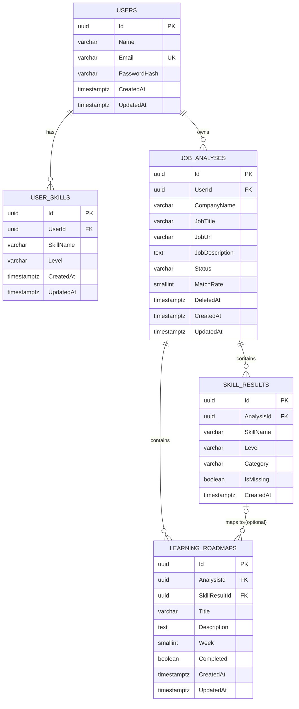

# DB設計

## ER図



---

## 命名・型の共通方針

- 主キーはすべて `uuid`。連番IDによるリソース推測・総件数の漏えいを避けるため。
  **[更新]** DBの `gen_random_uuid()` デフォルトではなく、**アプリケーション(Domain層のエンティティ)
  側で `Guid.NewGuid()` により生成する**方針に変更する。理由はDomain層のクラス設計セクションを参照。
  DB側のデフォルト値は「アプリを経由しない直接INSERT時の保険」として残すかは実装フェーズで判断する。
- 日時型は `timestamptz` を使用する。
- すべてのテーブルに `CreatedAt` を持たせる。更新され得るテーブルには `UpdatedAt` も持たせる。
- 論理削除が必要なテーブルには `DeletedAt`(nullable)を持たせる。

---

## テーブル定義

### Users

| カラム | 型 | 制約 |
|---|---|---|
| Id | uuid | PK |
| Name | varchar(100) | NOT NULL |
| Email | varchar(255) | NOT NULL, UNIQUE |
| PasswordHash | varchar(255) | NOT NULL |
| CreatedAt | timestamptz | NOT NULL, default now() |
| UpdatedAt | timestamptz | NOT NULL, default now() |

役割: ログイン、ユーザー管理

---

### UserSkill

ユーザーの保有スキル。AI分析における「不足スキル」判定の比較対象になる。

| カラム | 型 | 制約 |
|---|---|---|
| Id | uuid | PK |
| UserId | uuid | NOT NULL, FK → Users.Id (ON DELETE CASCADE) |
| SkillName | varchar(100) | NOT NULL |
| Level | varchar(20) | NOT NULL, enum: `Beginner` \| `Intermediate` \| `Advanced` |
| CreatedAt | timestamptz | NOT NULL, default now() |
| UpdatedAt | timestamptz | NOT NULL, default now() |

制約: `UNIQUE (UserId, SkillName)` — 同一ユーザーが同じスキル名を重複登録できない
(v1では完全一致のみで判定。表記ゆれ対策は将来検討)

---

### JobAnalysis

| カラム | 型 | 制約 |
|---|---|---|
| Id | uuid | PK |
| UserId | uuid | NOT NULL, FK → Users.Id (ON DELETE CASCADE) |
| CompanyName | varchar(200) | NOT NULL |
| JobTitle | varchar(200) | NOT NULL |
| JobUrl | varchar(2048) | NULL(参照用リンクのみ。サーバーはアクセスしない) |
| JobDescription | text | NOT NULL(ユーザーが貼り付けた求人本文) |
| Status | varchar(20) | NOT NULL, default `Pending`, enum: `Pending` \| `Completed` \| `Failed` |
| MatchRate | smallint | NULL(0〜100。Status=Completedで確定する) |
| DeletedAt | timestamptz | NULL(論理削除) |
| CreatedAt | timestamptz | NOT NULL, default now() |
| UpdatedAt | timestamptz | NOT NULL, default now() |

役割: 分析対象として保存した求人情報を保持する

インデックス: `(UserId, DeletedAt)` — 一覧取得の絞り込み用

---

### SkillResult

求人に必要なスキルと、ユーザーとの充足状況(不足しているか否か)を保持する。
「必要スキル」と「不足スキル」を1テーブルに統合し、`IsMissing` で区別する設計。

| カラム | 型 | 制約 |
|---|---|---|
| Id | uuid | PK |
| AnalysisId | uuid | NOT NULL, FK → JobAnalysis.Id (ON DELETE CASCADE) |
| SkillName | varchar(100) | NOT NULL |
| Level | varchar(20) | NOT NULL, enum: `Beginner` \| `Intermediate` \| `Advanced`(求人が求める習熟レベル) |
| Category | varchar(20) | NOT NULL, enum: `Required` \| `Preferred`(必須/歓迎) |
| IsMissing | boolean | NOT NULL, default false(ユーザーの保有スキルに無ければtrue。サーバー側算出) |
| CreatedAt | timestamptz | NOT NULL, default now() |

役割: AIが抽出した必要スキルと、不足判定結果を保持する

---

### LearningRoadmap

| カラム | 型 | 制約 |
|---|---|---|
| Id | uuid | PK |
| AnalysisId | uuid | NOT NULL, FK → JobAnalysis.Id (ON DELETE CASCADE) |
| SkillResultId | uuid | NULL, FK → SkillResult.Id (ON DELETE SET NULL)。どの不足スキルに対応する学習項目かを紐づける |
| Title | varchar(200) | NOT NULL |
| Description | text | NULL |
| Week | smallint | NOT NULL, CHECK (Week >= 1) |
| Completed | boolean | NOT NULL, default false |
| CreatedAt | timestamptz | NOT NULL, default now() |
| UpdatedAt | timestamptz | NOT NULL, default now() |

役割: AIが生成した学習プランを週単位で保持する

---

## Domain層のクラス設計

DB設計(上記テーブル定義)をもとに、Pure C#(EF Core非依存)なDomainエンティティを設計する。
以下はあくまで設計スケッチであり、実際の`.cs`ファイルはこの段階では作成しない。

### 設計方針

- **BaseEntity**: `Id`・`CreatedAt`・`UpdatedAt`の3項目は全エンティティ共通のため基底クラスに集約する
- **SoftDelete**: 全エンティティに`DeletedAt`を持たせるのではなく、`ISoftDeletable`インターフェースを
  分離する。現時点で論理削除が必要なのは`JobAnalysis`のみであり、将来他のエンティティにも
  論理削除が必要になった場合は`ISoftDeletable`を実装するだけで済む(インターフェース分離の原則)
- **ValueObject**: 不変条件(形式・範囲チェック)を持つ値には積極的にVOを使う
  (`Email`、`SkillName`、`MatchRate`)。逆に、単純な範囲チェック(CHECK制約)で十分なものは
  プリミティブ型のままにし、VOの乱用を避ける(理由は「検討したが見送ったVO」参照)
- **Enum**: `Level`・`Category`・`Status`はDBではvarchar(20)だが、Domainでは型安全な
  C# enumとして表現する。文字列⇔enum変換はInfrastructure層(EF CoreのFluent API)の責務とする
- **集約境界**: `JobAnalysis`を集約ルートとし、`SkillResult`・`LearningRoadmap`を子エンティティ
  としてカプセル化する。理由は後述の「集約境界の考え方」を参照
- **エンティティの可変性**: プロパティは`private set`とし、状態変更は意図の明確なメソッド
  (`CompleteAnalysis`、`MarkCompleted`等)を通してのみ行う。EF Coreとの相性を考慮し、
  完全なイミュータブル(Withメソッドで新インスタンスを生成する方式)までは採用しない

### 共通基盤(Domain/Common)

```csharp
// BaseEntity.cs
// Id/CreatedAt/UpdatedAtを共通化する基底クラス。EF Core等の外部ライブラリには依存しない。
public abstract class BaseEntity : IEquatable<BaseEntity>
{
    public Guid Id { get; protected set; } = Guid.NewGuid();
    public DateTimeOffset CreatedAt { get; protected set; } = DateTimeOffset.UtcNow;
    public DateTimeOffset UpdatedAt { get; protected set; } = DateTimeOffset.UtcNow;

    // 状態を変更したサブクラスのメソッドから呼び出し、更新日時を進める
    protected void Touch() => UpdatedAt = DateTimeOffset.UtcNow;

    // エンティティはIdが同じであれば同一とみなす(値の一致で比較するValueObjectとは異なる)
    public bool Equals(BaseEntity? other) =>
        other is not null && GetType() == other.GetType() && Id == other.Id;

    public override bool Equals(object? obj) => Equals(obj as BaseEntity);
    public override int GetHashCode() => HashCode.Combine(GetType(), Id);
}
```

```csharp
// ISoftDeletable.cs
// 論理削除が必要なエンティティだけが実装するインターフェース(ISP)。
public interface ISoftDeletable
{
    DateTimeOffset? DeletedAt { get; }
    bool IsDeleted => DeletedAt is not null;
    void MarkDeleted();
}
```

### Enum(Domain/Enums)

```csharp
public enum SkillLevel
{
    Beginner,
    Intermediate,
    Advanced
}

public enum SkillCategory
{
    Required,
    Preferred
}

public enum AnalysisStatus
{
    Pending,
    Completed,
    Failed
}
```

### ValueObject(Domain/ValueObjects)

不変条件を持つスマートコンストラクタパターン(private コンストラクタ + static Createメソッドで
不正な値のインスタンス化を型レベルで防ぐ)を採用する。

```csharp
// Email.cs
public sealed record Email
{
    public string Value { get; }

    private Email(string value) => Value = value;

    public static Email Create(string value)
    {
        if (string.IsNullOrWhiteSpace(value) || !value.Contains('@'))
            throw new ArgumentException("メールアドレスの形式が不正です。", nameof(value));

        return new Email(value.Trim().ToLowerInvariant());
    }

    public override string ToString() => Value;
}
```

```csharp
// SkillName.cs
public sealed record SkillName
{
    public string Value { get; }

    private SkillName(string value) => Value = value;

    public static SkillName Create(string value)
    {
        if (string.IsNullOrWhiteSpace(value))
            throw new ArgumentException("スキル名は必須です。", nameof(value));
        if (value.Length > 100)
            throw new ArgumentException("スキル名は100文字以内で入力してください。", nameof(value));

        return new SkillName(value.Trim());
    }

    public override string ToString() => Value;
}
```

```csharp
// MatchRate.cs
public sealed record MatchRate
{
    public int Value { get; }

    private MatchRate(int value) => Value = value;

    public static MatchRate Create(int value)
    {
        if (value is < 0 or > 100)
            throw new ArgumentOutOfRangeException(nameof(value), "MatchRateは0〜100の範囲で指定してください。");

        return new MatchRate(value);
    }
}
```

#### 検討したが見送ったVO

| 候補 | 見送り理由 |
|---|---|
| `WeekNumber`(LearningRoadmap.Week) | DB側のCHECK制約(`Week >= 1`)で不変条件を表現できており、VO化のメリットが薄い。v1では`int`のままとする |
| `HashedPassword`(Users.PasswordHash) | 「生パスワード文字列と誤って混同しない」型安全性のメリットはあるが、v1のスコープでは`string`のままでも実害が小さいと判断。ハッシュ生成・検証ロジックはInfrastructure層の`IPasswordHasher`に閉じ込めるため、Domain層で型を分ける優先度は低い |

### エンティティ(Domain/Entities)

```csharp
// User.cs
public sealed class User : BaseEntity
{
    public string Name { get; private set; }
    public Email Email { get; private set; }
    public string PasswordHash { get; private set; }

    private readonly List<UserSkill> _skills = new();
    public IReadOnlyCollection<UserSkill> Skills => _skills.AsReadOnly();

    private readonly List<JobAnalysis> _jobAnalyses = new();
    public IReadOnlyCollection<JobAnalysis> JobAnalyses => _jobAnalyses.AsReadOnly();

    private User() { } // EF Core用

    public User(string name, Email email, string passwordHash)
    {
        Name = name;
        Email = email;
        PasswordHash = passwordHash;
    }

    public void UpdateProfile(string name)
    {
        Name = name;
        Touch();
    }
}
```

```csharp
// UserSkill.cs
// Userの子だが、API上は独立したリソース(/users/me/skills/{id})として直接CRUDされるため、
// JobAnalysis集約ほど厳格なカプセル化(Userのメソッド経由でしか操作できない)はあえて課さない。
public sealed class UserSkill : BaseEntity
{
    public Guid UserId { get; private set; }
    public User User { get; private set; } = null!;

    public SkillName SkillName { get; private set; }
    public SkillLevel Level { get; private set; }

    private UserSkill() { }

    public UserSkill(Guid userId, SkillName skillName, SkillLevel level)
    {
        UserId = userId;
        SkillName = skillName;
        Level = level;
    }

    public void UpdateLevel(SkillLevel level)
    {
        Level = level;
        Touch();
    }
}
```

```csharp
// JobAnalysis.cs
// 集約ルート。SkillResult/LearningRoadmapの生成・更新はすべてこのクラスのメソッドを通す。
public sealed class JobAnalysis : BaseEntity, ISoftDeletable
{
    public Guid UserId { get; private set; }
    public User User { get; private set; } = null!;

    public string CompanyName { get; private set; }
    public string JobTitle { get; private set; }
    public string? JobUrl { get; private set; }
    public string JobDescription { get; private set; }

    public AnalysisStatus Status { get; private set; } = AnalysisStatus.Pending;
    public MatchRate? MatchRate { get; private set; }

    public DateTimeOffset? DeletedAt { get; private set; }
    public bool IsDeleted => DeletedAt is not null;

    private readonly List<SkillResult> _skillResults = new();
    public IReadOnlyCollection<SkillResult> SkillResults => _skillResults.AsReadOnly();

    private readonly List<LearningRoadmap> _roadmap = new();
    public IReadOnlyCollection<LearningRoadmap> Roadmap => _roadmap.AsReadOnly();

    private JobAnalysis() { }

    public JobAnalysis(Guid userId, string companyName, string jobTitle, string? jobUrl, string jobDescription)
    {
        UserId = userId;
        CompanyName = companyName;
        JobTitle = jobTitle;
        JobUrl = jobUrl;
        JobDescription = jobDescription;
    }

    // AI分析完了時に呼び出す。SkillResult/LearningRoadmap/MatchRateを一括で確定させる。
    public void CompleteAnalysis(IEnumerable<SkillResult> skillResults, IEnumerable<LearningRoadmap> roadmap, MatchRate matchRate)
    {
        _skillResults.Clear();
        _skillResults.AddRange(skillResults);
        _roadmap.Clear();
        _roadmap.AddRange(roadmap);
        MatchRate = matchRate;
        Status = AnalysisStatus.Completed;
        Touch();
    }

    public void FailAnalysis()
    {
        Status = AnalysisStatus.Failed;
        Touch();
    }

    // 求人本文を変更した場合は再分析が必要になるためStatusをPendingへ戻す
    public void UpdateJobPosting(string companyName, string jobTitle, string? jobUrl, string jobDescription)
    {
        CompanyName = companyName;
        JobTitle = jobTitle;
        JobUrl = jobUrl;
        JobDescription = jobDescription;
        Status = AnalysisStatus.Pending;
        Touch();
    }

    public void CompleteRoadmapItem(Guid roadmapItemId)
    {
        var item = _roadmap.SingleOrDefault(r => r.Id == roadmapItemId)
            ?? throw new InvalidOperationException("指定されたロードマップ項目がこの分析に存在しません。");
        item.MarkCompleted();
        Touch();
    }

    public void MarkDeleted() => DeletedAt = DateTimeOffset.UtcNow;
}
```

```csharp
// SkillResult.cs
public sealed class SkillResult : BaseEntity
{
    public Guid AnalysisId { get; private set; }
    public JobAnalysis Analysis { get; private set; } = null!;

    public SkillName SkillName { get; private set; }
    public SkillLevel Level { get; private set; }
    public SkillCategory Category { get; private set; }
    public bool IsMissing { get; private set; }

    private SkillResult() { }

    public SkillResult(SkillName skillName, SkillLevel level, SkillCategory category, bool isMissing)
    {
        SkillName = skillName;
        Level = level;
        Category = category;
        IsMissing = isMissing;
    }
}
```

```csharp
// LearningRoadmap.cs
public sealed class LearningRoadmap : BaseEntity
{
    public Guid AnalysisId { get; private set; }
    public JobAnalysis Analysis { get; private set; } = null!;

    public Guid? SkillResultId { get; private set; }
    public SkillResult? SkillResult { get; private set; }

    public string Title { get; private set; }
    public string? Description { get; private set; }
    public int Week { get; private set; }
    public bool Completed { get; private set; }

    private LearningRoadmap() { }

    public LearningRoadmap(Guid? skillResultId, string title, string? description, int week)
    {
        if (week < 1)
            throw new ArgumentOutOfRangeException(nameof(week), "Weekは1以上で指定してください。");

        SkillResultId = skillResultId;
        Title = title;
        Description = description;
        Week = week;
    }

    // JobAnalysis.CompleteRoadmapItem経由でのみ呼ばれる想定
    internal void MarkCompleted()
    {
        Completed = true;
        Touch();
    }
}
```

### Navigation Property一覧

| エンティティ | プロパティ | 種類 |
|---|---|---|
| User | Skills | `IReadOnlyCollection<UserSkill>` |
| User | JobAnalyses | `IReadOnlyCollection<JobAnalysis>` |
| UserSkill | User | 参照ナビゲーション |
| JobAnalysis | User | 参照ナビゲーション |
| JobAnalysis | SkillResults | `IReadOnlyCollection<SkillResult>` |
| JobAnalysis | Roadmap | `IReadOnlyCollection<LearningRoadmap>` |
| SkillResult | Analysis | 参照ナビゲーション |
| LearningRoadmap | Analysis | 参照ナビゲーション |
| LearningRoadmap | SkillResult | 参照ナビゲーション(nullable) |

いずれも公開コレクションは`IReadOnlyCollection<T>`とし、外部から直接`Add`/`Remove`できないようにする。
変更は必ずエンティティのメソッド(`CompleteAnalysis`等)を経由させる。

### 集約境界の考え方

- **JobAnalysis集約**(JobAnalysis + SkillResult + LearningRoadmap): 3者は常にAI分析という
  1つの操作単位で作成・更新され(`IUnitOfWork`で同一トランザクション化する設計は
  `architecture.md`で決定済み)、API設計上もSkillResult/LearningRoadmapを単独でCRUDする
  エンドポイントは存在しない(`GET /analyses/{id}`に埋め込み、更新は
  `PATCH /analyses/{id}/roadmap/{id}`のみ)。よって`JobAnalysis`を集約ルートとして
  厳格にカプセル化する設計は実際のAPI境界と一致しており、過剰な抽象化ではないと判断した。
- **User / UserSkill**: `UserSkill`はAPI設計上`/users/me/skills/{id}`という独立したエンドポイントを
  持ち、単独でCRUDされる。そのため`User`を経由しないと`UserSkill`を操作できない厳格な集約には
  せず、`IUserSkillRepository`を別途用意する非対称な設計とした。厳密なDDDの原則からは外れるが、
  実際のAPI・ユースケースの形に沿わせることを優先した設計判断である。

---

## v1で採用した設計方針(前回レビュー反映)

- `UserSkill` を新設し、不足スキル算出の前提データを追加した
- 全テーブルに型・NOT NULL・UNIQUE・FK・インデックスを付与した
- 主キーを `uuid` にし、リソースIDの推測によるIDOR誘発リスクを下げた
- `JobAnalysis` に `Status`/`DeletedAt` を追加し、AI分析失敗時の状態と論理削除に対応した
- `SkillResult` に `IsMissing` を追加し、「必要スキル」と「不足スキル」を1テーブルで表現した
- `LearningRoadmap` に `SkillResultId` を追加し、学習項目と不足スキルの対応関係を追跡可能にした

---

## 設計上の懸念点と改善案

| # | 懸念点 | 改善案 |
|---|---|---|
| 1 | PKの生成方法を「DBのデフォルト値」から「アプリ側でのGuid生成」に変更する提案をしたが、これは前回合意した設計の変更にあたる | Infrastructure層の実装時にEF Coreの`ValueGeneratedNever()`設定が必要になる点を明記し、着手前に承認を得る |
| 2 | ValueObject(Email/SkillName/MatchRate)やprivateコンストラクタを使うエンティティは、EF Coreでのマッピング(バックフィールド指定、`OwnsOne`、コンストラクタバインディング)が複雑になる | Infrastructure層のFluent API設計時に個別に検証する。最悪の場合、一部VOをやめてプリミティブ型に戻す判断もあり得ることを許容しておく |
| 3 | `User.JobAnalyses`と`JobAnalysis.User`のような双方向ナビゲーションは循環参照になり、そのままJSON直列化するとループする | WebApiはEntityを直接返さずDTOを介する方針を徹底する(`architecture.md`のController責務に既に明記済みだが、双方向参照がある分とくに注意が必要) |
| 4 | 論理削除(`DeletedAt`)はDomain層が持つだけで、「削除済みを一覧から除外する」判断はしない設計にした | 除外ロジックはInfrastructure層のEF Core Global Query Filterに実装する方針とし、Domain層に削除済みかどうかの分岐ロジックを持ち込まないことを明記しておく |
| 5 | `JobAnalysis.UpdateJobPosting`で本文変更時にStatusをPendingへ戻す設計にしたが、既存のSkillResult/Roadmapを即座にクリアするか、再分析完了まで古い結果を表示し続けるかはUX次第で結論が変わる | 実装着手前にUX側の希望を確認する(未確定事項として次項に記載) |
| 6 | Domain層の例外は`ArgumentException`等のBCL標準例外を使っている。Application層で「これはドメインルール違反である」と明確に判別しづらい可能性がある | v1では簡潔さを優先しBCL例外のままとするが、Application層のエラーハンドリングが複雑化してきたら`DomainException`基底クラスの導入を再検討する |
| 7 | `SkillName`にVOを導入したが正規化(NormalizedValue)は持たせていない。表記ゆれ(例: "React"と"react"が別スキル扱いになる)は解消されないまま | 将来正規化対応する際もVOの内部実装を変更するだけで済むよう設計してあるため、対応コストは低い。v1では対応しない |

---

## 未確定事項(要確認)

- `SkillName` の正規化(trim・大文字小文字統一)をアプリケーション層/DB層のどちらで行うか
- `Level`・`Category` をEF Core上でC# enumにするか、マスタテーブル化するかは実装フェーズで決定する
- PKの生成方式をDBデフォルトからアプリ側Guid生成に変更してよいか(懸念点1)
- 求人編集(本文変更)時、既存のSkillResult/Roadmapを即座にクリアするか、再分析完了まで残すか(懸念点5)
